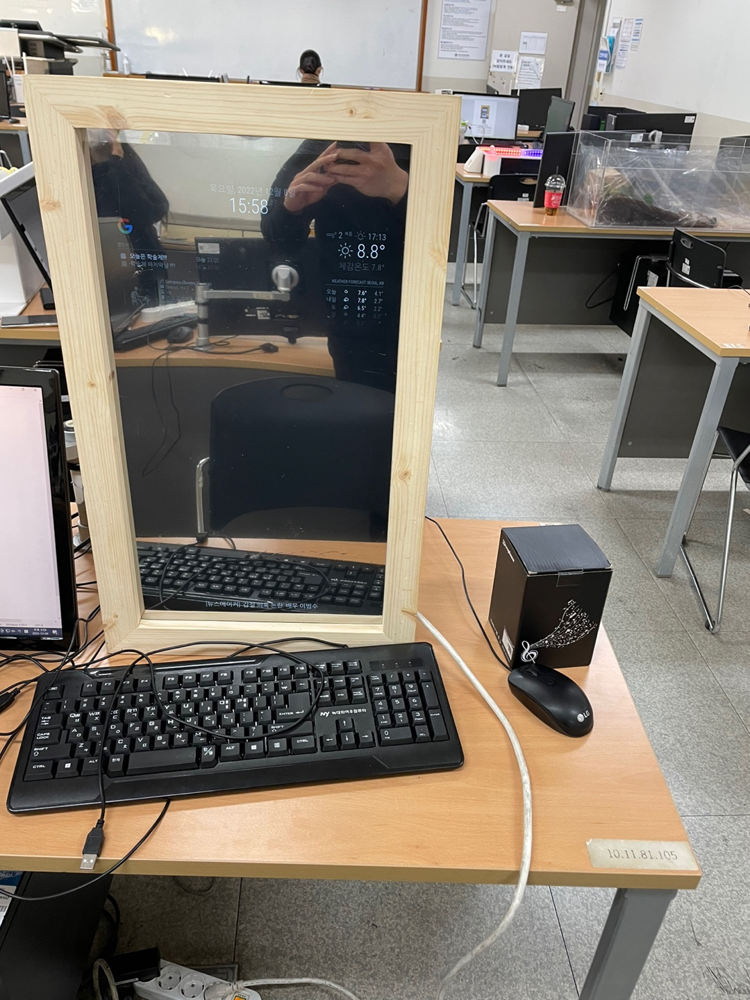
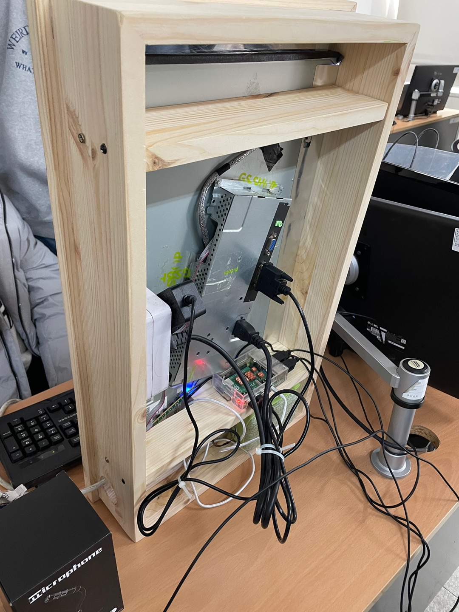

# ISM
### 라즈베리파이 키트를 활용한 스마트 미러


## 프로젝트 요약
> 6인 팀 프로젝트
> 2022.09.06 - 2022.12.09  
 
> **스마트 미러 프로젝트**
* 라즈베리파이에 구축한 매직 미러 서버를 통해 날씨, 캘린더, 현재 시간 디스플레이에 표시
* 구글 어시스턴트와 같은 음성인식기술로 스포티파이 재생
* 미러의 맨 하단에는 실시간으로 오늘자 뉴스기사가 깜빡임 모션을 통해 보여지도록 구현
<br>

## 프로젝트 구성도 및 로직

1. 라즈베리파이(클라이언트)에서 API(날씨, 구글 어시스턴트, 캘린더)를 요청
<br> 
2. Web Server에서 해당 Data 값(json 형태)로 응답
<br>
3. Google Assistant를 동작하기 위한 Google 인증을 Token 값을 받아 처리
<br>
4. 미러 뒤에 설치한 마이크 음성을 인식하여 구글 어시스턴트 서비스 실행
<br>
5. 구글 어시스턴트 실행 후 미리 설치한 Spotify 서비스를 호출

## 스포티파이 음악 재생 명령어(noje js파일에서 명령어 구성하였으나 파일이 없어 올립니다)
* 어시스턴트(자비스) 서비스 호출
* "노래 찾기" : "스포티파이에서 (가수 이름)찾아줘"
* "노래 멈추기" : "스포티파이 멈춰, 스포티파이 스탑, 스포티파이 스톱"
* "노래 재생": "스포티파이 플레이"
* "노래 일시정지" : "스포티파이 일시정지"
* "음량 조절" : "스포티파이 음량(원하는 숫자 100)"

## 담당 역할
 
### 캡스톤 디자인 주제 선정 및 기획
* 수업 첫 차시에 간단히 제작할 수 있으면서도 유용한 기능이 있는 제품군 검색
* 주제를 선정하고 어떤 기능을 넣어야 할 지 팀원들과 논의
  
### open weather api, RaspberryPI 연동
* 라즈베리파이 내의 config.js 파일에서 open weather api에서 받아온 api key를 넣어 현재 지역과 현재 날씨를 받아옴
```
{
			module: "weather",
			position: "top_right",
			config: {
				weatherProvider: "openweathermap",
				type: "current",
				location: "Seoul",
				locationID: "1835847", //ID from http://bulk.openweathermap.org/sample/city.list.json.gz; unzip the gz file and find your city
				apiKey: "여러분의 API KEY",
				onlyTemp: true
			}
		},
		{
			module: "weather",
			position: "top_right",
			//header: "예보",
			config: {
				weatherProvider: "openweathermap",
				type: "forecast",
				location: "Seoul",
				locationID: "1835847", //ID from http://bulk.openweathermap.org/sample/city.list.json.gz; unzip the gz file and find your city
				apiKey: "여러분의 API KEY"
			}
		},
```

### 문서 정리 및 피드백
* 프로젝트 차시 별로 진행한 내용, 예산요청지급서, 결과보고서 등을 작성
* 담당 교수님과의 컨펌을 주도하여 프로젝트 시의 불편한 사항, 개선해야 할 부분에 대하여 논의

## 사용 API 및 패키지
* open weather: https://openweathermap.org/api
* google assistant: https://developers.google.com/assistant/sdk/reference/rpc?hl=ko
* google calender: https://developers.google.com/calendar/api/guides/overview?hl=ko
* spotify:https://github.com/skuethe/MMM-Spotify
* MagicMirror:https://github.com/MichMich/MagicMirror
 
## 결과 영상
* https://www.youtube.com/shorts/hSjICcPyh6Q
